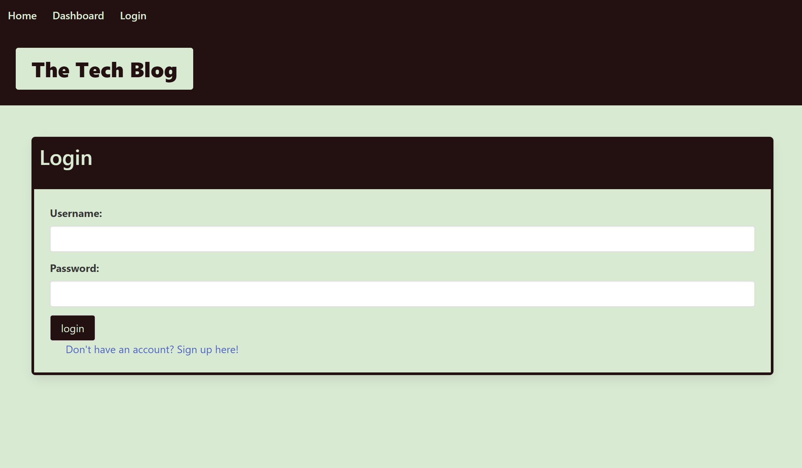
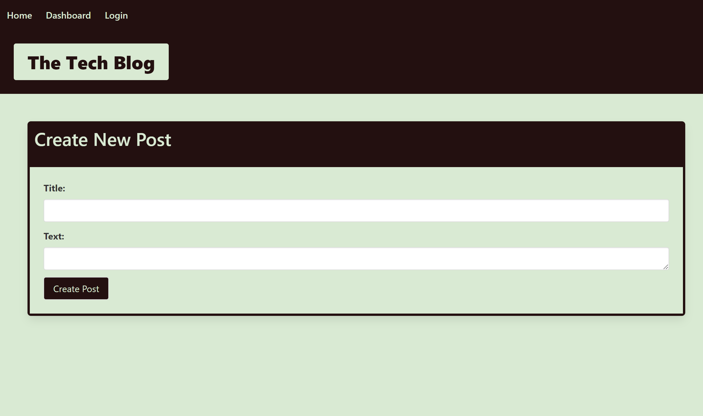
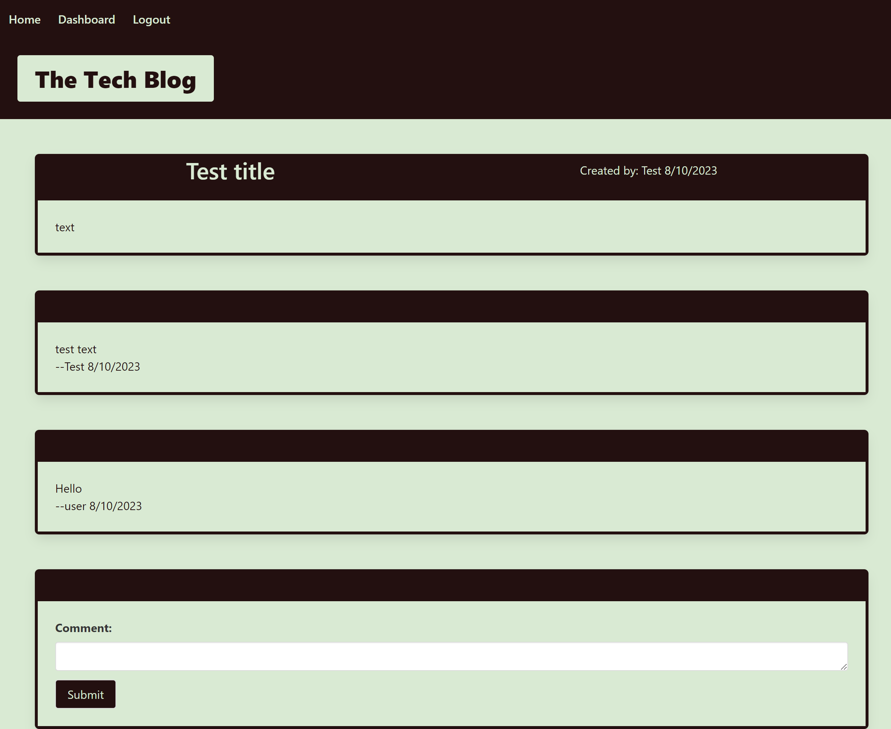

# Tech_Blog 
CMS-style blog site, where developers can publish their blog posts and comment on other developers’ posts as well

  ## Description

  Tech Blog was created for UCF bootcamp class as an application to create a database for saving users and their posts and comments.The application was designed to go along with learning and display student ability to utilize knowledge on JavaScript, node.js, and sequelize.

  ## Table of Contents

  1. [Installation](#installation)
  2. [Usage](#usage)
  3. [Credits](#credits)
  4. [License](#license)
  5. [Contributing](#contributing)
  6. [Tests](#tests)
  7. [Questions](#questions)

  ## Installation 

  N/A

  ## Usage 

   The homepage shows posts created on the application. If the user is not logged in, they can not view the comments for the post or create their own. The user will be able to login or sign up using the form that appears when clicking "login". After logging in or signing up, the user can click on a post to view the comments on it and add a comment to it. When clicking on "dashboard" the user can view their posts and create a new post. 

   
   
   

  ## Credits 

  Concept provided by the boot camp creators at [UCF Boot Camps](https://bootcamp.ce.ucf.edu/).

  ## License 

  Licensed under [MIT](LICENSE)

  ## Contributing 

  To contribute, fork the project into your GitHub account and create a pull request.

  ## Tests 

  N/A

  ## Questions 

  Github: [SienkC](https://github.com/SienkC)
  
  For any questions please reach out to me at sienkiewichc@gmail.com.
